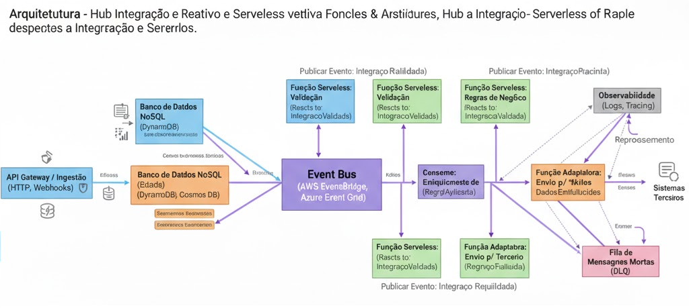

# TESTE TÉCNICO - TECH LEAD .NET - TOTVS 
Documentação da arquitetura do Hub de Integração de Terceiros

# Proposta de Arquitetura: Hub de Integração Reativo e Serverless

**Data:** 15 de Outubro de 2025
**Autor:** Reginaldo Filho

## 1. Introdução

Esta proposta descreve uma arquitetura de software para um sistema de hub de integração, projetado para ser resiliente, escalável e observável. A abordagem escolhida é baseada em um modelo **reativo, orientado a eventos e *serverless***, que utiliza uma coreografia de serviços desacoplados em vez de uma orquestração centralizada.

Este modelo é ideal para atender aos requisitos não funcionais, pois aproveita a escalabilidade e a resiliência nativas dos serviços de nuvem gerenciados, ao mesmo tempo que promove a agilidade no desenvolvimento e a otimização de custos.

---

## 2. Diagrama de Arquitetura (Alto Nível)

A arquitetura se baseia em um barramento de eventos central que coordena o fluxo de trabalho entre funções computacionais independentes.

**Fluxo Principal:**

1.  **Entrada:** Requisições síncronas (APIs) e assíncronas (Webhooks) chegam através de um **API Gateway**.
2.  **Publicação do Evento Inicial:** O Gateway não processa a lógica, ele apenas valida a autenticidade e publica um evento inicial (ex: `IntegracaoRequisitada`) no **Event Bus**.
3.  **Coreografia de Eventos:**
    * Uma **Função *Serverless*** de validação consome o evento `IntegracaoRequisitada`, valida os dados e, se bem-sucedida, publica um novo evento: `IntegracaoValidada`.
    * Outras funções reagem ao evento `IntegracaoValidada` para executar regras de negócio, enriquecer dados, etc., cada uma publicando seus próprios eventos de resultado (ex: `RegraAplicada`, `DadosEnriquecidos`).
    * Finalmente, uma função "Adaptadora" consome um evento final e se comunica com o sistema terceiro.
4.  **Armazenamento de Estado:** Funções específicas persistem o estado atual do fluxo em um **Banco de Dados NoSQL** para consultas rápidas.
5.  **Tratamento de Falhas:** Qualquer falha no processamento de um evento faz com que a mensagem seja enviada para uma **Fila de Mensagens Mortas (DLQ)** para análise e reprocessamento manual ou automático.

---

## 3. Justificativas Técnicas

As escolhas tecnológicas foram feitas para maximizar o alinhamento com os requisitos não funcionais.

| Componente                | Tecnologia Exemplo                      | Justificativa                                                                                                                                                                                                                                                                                       |
| :------------------------ | :-------------------------------------- | :-------------------------------------------------------------------------------------------------------------------------------------------------------------------------------------------------------------------------------------------------------------------------------------------------- |
| **API Gateway** | AWS API Gateway, Azure API Management   | **Ponto de Entrada Unificado e Seguro:** Centraliza a gestão de APIs, aplicando nativamente segurança (autenticação/autorização com JWT, API Keys), WAF, limitação de taxa (*rate limiting*) e cache, reduzindo a carga sobre os serviços de negócio.                                                 |
| **Event Bus** | AWS EventBridge, Azure Event Grid       | **Desacoplamento e Escalabilidade:** Coração da arquitetura. Permite que os serviços (funções) evoluam de forma independente. Adicionar um novo passo no fluxo significa apenas criar uma nova função que reage a um evento existente, sem alterar os serviços produtores. Promove escalabilidade massiva e resiliência, pois a falha de um consumidor não impacta os outros. |
| **Funções *Serverless*** | AWS Lambda, Azure Functions             | **Escalabilidade Horizontal e Custo-Benefício:** A computação é provisionada sob demanda. A plataforma escala de zero a milhares de execções concorrentes automaticamente, sem gerenciamento de servidores. O modelo de pagamento por uso garante que os custos estejam diretamente ligados ao volume de requisições, sendo extremamente eficiente. |
| **Banco de Dados NoSQL** | AWS DynamoDB, Azure Cosmos DB           | **Performance e Escalabilidade para Estado:** Ideal para o modelo *serverless* devido à sua alta performance em leituras/escritas baseadas em chave-valor e escalabilidade gerenciada. O esquema flexível facilita a evolução do modelo de dados sem migrações complexas.                       |
| **Fila de Mensagens Mortas (DLQ)** | AWS SQS, Azure Storage Queues | **Tolerância a Falhas:** Garante que nenhuma requisição seja perdida. Mensagens que falham após múltiplas tentativas são isoladas em uma DLQ, permitindo que o fluxo principal continue operando enquanto a equipe de operações investiga a falha sem pressão.                                         |

---

## 4. Estratégias para Garantir Estabilidade, Rastreabilidade e Segurança

| Requisito                                                 | Estratégia Implementada                                                                                                                                                                                                                                                                                                                                                                                                                                                                                                                                                                                                                                                                                      |
| :-------------------------------------------------------- | :--------------------------------------------------------------------------------------------------------------------------------------------------------------------------------------------------------------------------------------------------------------------------------------------------------------------------------------------------------------------------------------------------------------------------------------------------------------------------------------------------------------------------------------------------------------------------------------------------------------------------------------------------------------------------------------------------------- |
| **Estabilidade (Alta Disponibilidade e Tolerância a Falhas)** | **1. Redundância Nativa:** Todos os serviços de nuvem gerenciados (Gateway, Event Bus, Lambda, DynamoDB) são, por padrão, distribuídos em múltiplas zonas de disponibilidade (Multi-AZ), garantindo alta disponibilidade sem configuração adicional. **2. Retentativas Automáticas:** Configuração de políticas de retentativa com *exponential backoff* para chamadas a sistemas externos e no consumo de eventos, lidando com falhas transitórias. **3. Desacoplamento:** O Event Bus atua como um *buffer*. Se um serviço consumidor estiver fora do ar, os eventos se acumulam no barramento (dentro dos limites de retenção) e são processados quando o serviço se recupera, evitando perda de dados. |
| **Rastreabilidade (Observabilidade)** | **1. Correlation ID:** Cada requisição que entra no API Gateway recebe um ID de correlação único (`X-Correlation-ID`) que é obrigatoriamente propagado em todos os eventos e logs gerados por todas as funções. Isso permite rastrear uma transação de ponta a ponta. **2. Logs Estruturados:** Todas as funções devem gerar logs em formato JSON, contendo o *Correlation ID*, o nome da função e dados de contexto. Isso facilita a busca e análise em ferramentas como AWS CloudWatch Logs Insights ou Azure Monitor. **3. Tracing Distribuído:** Utilização de ferramentas como AWS X-Ray ou OpenTelemetry para gerar um mapa visual do fluxo da requisição através dos diferentes componentes, identificando gargalos e erros. |
| **Segurança** | **1. Perímetro Seguro:** O API Gateway é a única porta de entrada, protegido por WAF e políticas de autenticação/autorização robustas. **2. Princípio do Menor Privilégio (IAM):** Cada função *serverless* possui uma política de IAM (Identity and Access Management) específica, permitindo que ela acesse apenas os recursos estritamente necessários (ex: "Função A" só pode publicar no "Event Bus B" e ler da "Tabela C"). **3. Gerenciamento de Segredos:** Credenciais e chaves de API para sistemas de terceiros devem ser armazenadas de forma segura em um cofre, como o AWS Secrets Manager ou o Azure Key Vault, e injetadas nas funções em tempo de execução. |

---

## 5. Pontos de Atenção e Riscos Identificados

| Risco                                                      | Descrição                                                                                                                                                                   | Mitigação                                                                                                                                                                                                              |
| :--------------------------------------------------------- | :-------------------------------------------------------------------------------------------------------------------------------------------------------------------------- | :--------------------------------------------------------------------------------------------------------------------------------------------------------------------------------------------------------------------- |
| **Complexidade de Rastreamento (Risco de "Monólito Distribuído")** | Em uma coreografia, o fluxo de negócio não está explícito em um único lugar, o que pode dificultar o entendimento e o debug de uma transação completa.                      | **Disciplina rigorosa na implementação da Observabilidade:** Exigir o uso do *Correlation ID* em todos os pontos, investir em ferramentas de *tracing* distribuído e manter uma documentação clara dos fluxos de eventos. |
| **Gerenciamento de Transações Distribuídas** | Garantir a consistência de dados em múltiplos sistemas sem um orquestrador central é um desafio. Uma falha no meio de um fluxo pode deixar o sistema em um estado inconsistente. | Para fluxos complexos que exigem compensação, implementar o padrão **Saga**. Cada passo do fluxo publica um evento de sucesso ou falha. Em caso de falha, eventos de compensação são disparados para reverter as ações anteriores. |
| ***Cold Starts* de Funções** | A primeira invocação de uma função *serverless* após um período de inatividade pode ter uma latência maior (o "cold start"), o que pode impactar o tempo de resposta de APIs síncronas. | Para endpoints críticos de baixa latência, utilizar o recurso de **"Concurrency Provisionada"** (AWS) ou **"Premium Plan"** (Azure) para manter um número de instâncias da função "aquecidas" e prontas para uso.       |
| ***Vendor Lock-in*** | A alta dependência de serviços gerenciados de um provedor de nuvem específico (AWS, Azure, GCP) pode dificultar uma futura migração.                                             | Estar ciente do trade-off. O ganho em velocidade de desenvolvimento e redução de custo operacional geralmente compensa o risco. Utilizar frameworks como o Serverless Framework ou OpenTelemetry pode ajudar a abstrair parte da infraestrutura. |
